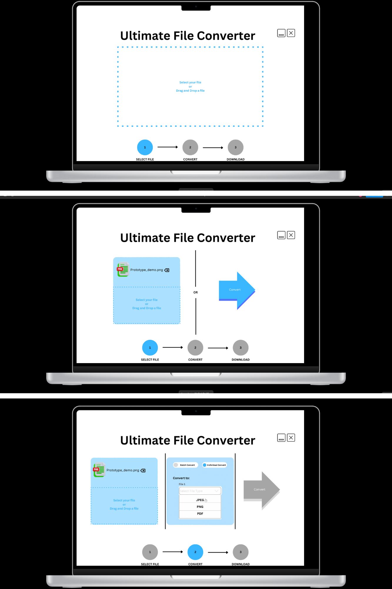

# Simple Intuitive File Converter Prototype

## Project Overview

This project is a **Simple Intuitive File Converter Prototype** created as part of a Human-Computer Interaction (HCI) course. Its goal was to **design, develop, and evaluate an interactive system with a human-computer interface**, following an iterative process that emphasizes:

- Conceptualizing and grounding ideas in HCI concepts and theories  
- Learning the full cycle of design, development, and evaluation  
- Applying appropriate evaluation methodologies in a specific context  
- Analyzing and selecting between different design approaches  

**Main Steps in the Project:**  

1. Decide on the type of project to pursue  
2. Conceptualize a project idea  
3. Design and prototype the interface/system  
4. Develop and implement the interface/system  
5. Develop a plan to evaluate the interface/system  
6. Conduct a final evaluation/study 

## Project Structure

```
file-converter/
│
├── public/                         # Public assets and static files
│   ├── images/                     # Folder containing image assets used in the app
│   ├── index.html                  # Main HTML template
│   ├── favicon.ico                 # App icon shown in browser tab
│   └── manifest.json               # App metadata for PWA (Progressive Web App)
│
├── src/                            # Source files
│   ├── app.js                      # Main React component (routes & app structure)
│   ├── index.js                    # Entry point for React app, renders App
│   ├── index.css                   # Global styling
│   ├── home.js                     # Home page component
│   ├── convert.js                  # File conversion component
│   ├── download.js                 # Download page/component
│   └── loading.js                  # Loading page/component
│
├── [Project_Description.pdf](Project_Description.pdf)         # Original project description from class
├── [HCI_Project_Report.pdf](HCI_Project_Report.pdf)          # Final project report with research and evaluation
├── package.json                     # Project metadata, dependencies, and scripts
├── package-lock.json                # Exact versions of installed dependencies
├── .gitignore                       # Specifies files/folders to ignore in Git
└── README.md                        # Project documentation
```

## Notes

- Demonstrates React skills, component organization, and front-end development workflow  
- Some features may be incomplete; the project is meant to showcase development and design ability
- The UI was designed for a specific browser size. For optimal display, you may need to resize your browser window.

## Screenshots / Figma Preview



Access the design prototype here:

- [Figma Project](https://www.figma.com/design/krIvae7HGwidUFFjqn7dNE/HCI-File-Converter-Project?node-id=6-2&t=xWx0WZkTmrBSKKFW-0)  
- [Figma Demo](https://www.figma.com/proto/krIvae7HGwidUFFjqn7dNE/HCI-File-Converter-Project?node-id=55-12&p=f&t=yNBEcnBViOyExLWv-0&scaling=scale-down&content-scaling=fixed&page-id=6%3A2&starting-point-node-id=55%3A12)

## Installation & Running the App

Make sure you have [Node.js and npm](https://nodejs.org/) installed.

```bash
cd file-converter
npm install
npm start
```

Open [http://localhost:3000](http://localhost:3000) in your browser to use the app.
